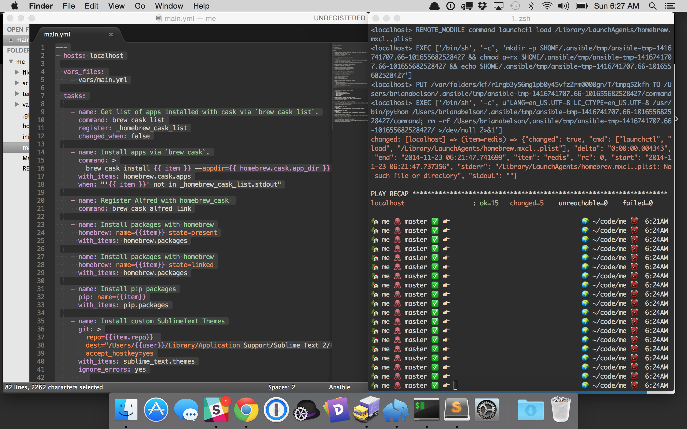
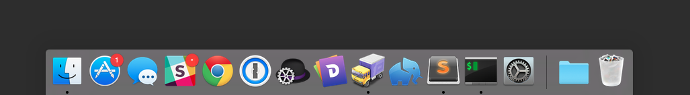

# me

An ansible playbook for generating my development environment.

## Run
(Assuming you've installed `git`.)

1. Clone the repository:
  - `git clone https://github.com/abelsonlive/me.git && cd me/`

2. Install build requirements
  - `./init.sh`
  - This script will prompt you to install xcode command line tools and ask you for your system password.

3. Build System
  - `make build`

## Configuration 

see [`vars/main.yml`](vars/mail.yml)

## Defaults

(located in see [`vars/main.yml`](vars/mail.yml))

* Homebrew casks

  - alfred
  - dash
  - iterm2
  - slack
  - openoffice
  - spotify
  - tunnelbear
  - dropbox
  - java
  - pg-commander
  - sublime-text
  - skype
  - vagrant
  - gdal-framework
  - mapbox-studio
  - postgres
  - tilemill
  - virtualbox
  - google-chrome
  - onepassword
  - soundflower
  - transmit
  - xquartz

* Homebrew packages

  - gcc 
  - wget 
  - postgresql
  - mysql
  - sqlite
  - gdal
  - redis
  - elasticsearch 
  - rabbitmq 
  - ffmpeg
  - git
  - libevent
  - sl

* Launchd services

  - postgresql
  - elasticsearch
  - rabbitmq 
  - redis 

* Python packages 

  - pip
  - ipython
  - virtualenvwrapper

* Oh-My-Zsh 

  - My custom `.zsh-theme` is installed (see [files/abelsonlve.zsh-theme](files/abelsonlve.zsh-theme)])

* Git 
  - global username and email are set.

* Sublime Text 

  - [Michael Keller's](http://twitter.com/mhkeller) custom [sublime-text theme](git://github.com/mhkeller/spacegray.git) is installed (though you'll have to activate it manually in the app.

* iTerm2 

  - [Michael Keller's](http://twitter.com/mhkeller) custom [iterm color set](files/SpaceGrayEighties.itermcolors) is included (though you'll have to activate import it manually into the App).

## Manual Steps

  1. Install [Sublime Package Manager](http://sublime.wbond.net/installation).
  2. Activate Sublime Text Themes.
  3. Import itemcolors into iTerms2
  4. Link 1Password and Transmit to Dropbox.
  5. Make the dock look like this

    

  6. Set Hot Corners like this

    

